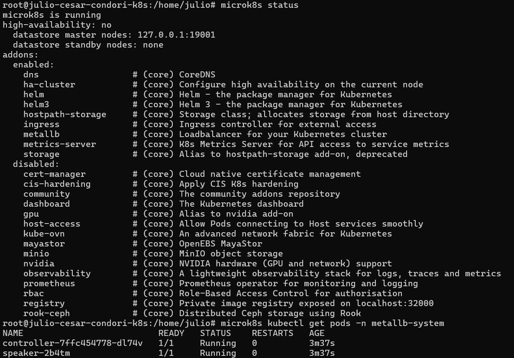
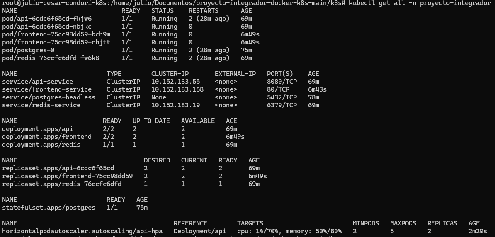
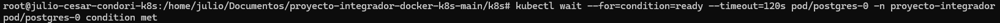
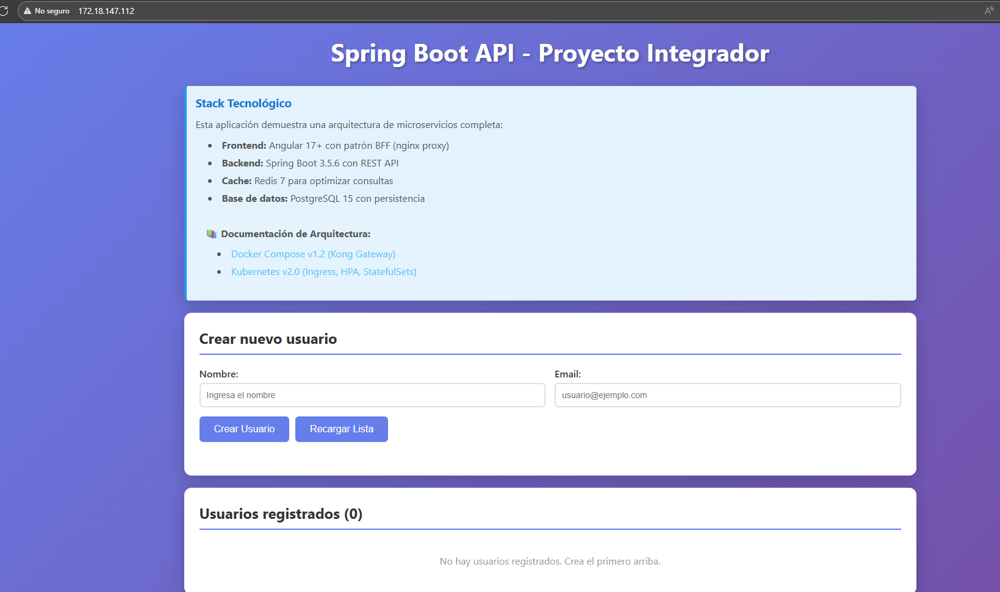
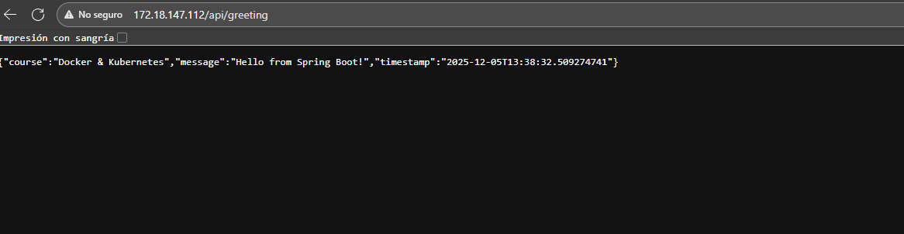
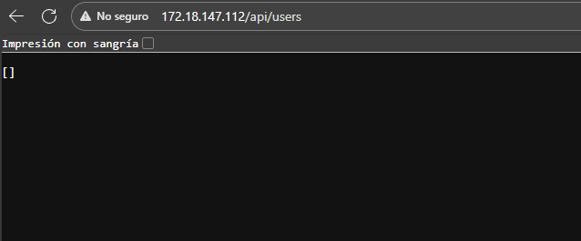

# Proyecto Final - Curso Docker & Kubernetes

## Objetivo 

Preparar ambiente con microk8s, Docker y MetalLB

# Parte 1

## 1. Instalación de MicroK8s

MicroK8s se instaló utilizando Snap:

```bash
sudo snap install microk8s --classic
```

Se añadió el usuario actual al grupo `microk8s`:

```bash
sudo usermod -aG microk8s $USER
sudo chown -f -R $USER ~/.kube
```

Luego, se verificó el estado:

```bash
microk8s status --wait-ready
```

##  Activación de Addons esenciales

Los addons requeridos para Kubernetes se habilitaron así:

```bash
microk8s enable dns
microk8s enable ingress
microk8s enable storage
microk8s enable registry
microk8s enable metrics-server
```
**Screenshot:**




---
## 2. Proyecto v2.0 funcionando en el cluster

Ante de configurar el proyecto integrador se procede a verificar requisitos previos

### . Verificar que microk8s esté corriendo

```bash
microk8s status
```

### . Verificar conectividad del cluster

```bash
microk8s kubectl cluster-info
```

con las respuestas esperadas se procede con el punto 8, ya que los puntos 2,3,4,5,6,7 se realizaron en el anterior paso 

### 2. Preparar las Imágenes Docker - Importar imágenes desde Docker local

**Screenshot:**



 donde se opta por la opcion B teniendo en cuenta lo siguiente:
 
 **Ventaja:** Funciona sin internet, las imágenes están cacheadas localmente.

**Desventaja:** Proceso de export/import más largo.

### 3. Ingress resolviendo el frontend

Para esta parte se siguieron los siguientes pasos 

## Paso 1: Configuración (ConfigMaps y Secrets)

```bash
kubectl apply -f 01-configmaps/api-config.yaml
kubectl apply -f 01-configmaps/frontend-config.yaml
kubectl apply -f 02-secrets/postgres-secret.yaml
```

## Paso 2: Base de Datos (PostgreSQL con StatefulSet)

### 2.1 Crear Headless Service

```bash
kubectl apply -f 04-databases/postgres-headless.yaml
```

### 2.2 Crear StatefulSet con PersistentVolumeClaim

```bash
kubectl apply -f 03-storage/postgres-statefulset.yaml
```

### 2.3 Esperar a que PostgreSQL esté listo

```bash
kubectl wait --for=condition=ready --timeout=120s pod/postgres-0 -n proyecto-integrador
```
**Screenshot:**



## Paso 3: Cache (Redis)

```bash
kubectl apply -f 04-databases/redis-deployment.yaml
kubectl apply -f 04-databases/redis-service.yaml
```
## Paso 4: Backend (Spring Boot API)

### 4.1 Desplegar API

```bash
kubectl apply -f 05-backend/api-deployment.yaml
kubectl apply -f 05-backend/api-service.yaml
```


### 4.2 Esperar a que la API esté lista (puede tomar 2-3 minutos)

```bash
kubectl wait --for=condition=available --timeout=180s deployment/api -n proyecto-integrador
```
## Paso 5: Frontend (Angular)

```bash
kubectl apply -f 06-frontend/frontend-deployment.yaml
kubectl apply -f 06-frontend/frontend-service.yaml
```

## Paso 6: Ingress (Routing HTTP)

```bash
kubectl apply -f 07-ingress/app-ingress.yaml
```
## Paso 7: HPA (Horizontal Pod Autoscaler)

```bash
kubectl apply -f 05-backend/api-hpa.yaml
```

**Screenshot: Captura del navegador usando la IP de MetalLB**



**Screenshot: **



**Screenshot: **


---


## 3 Identidad del ambiente validada	

Se adjunta capturas del equipo levantado juntamente con la terminal


